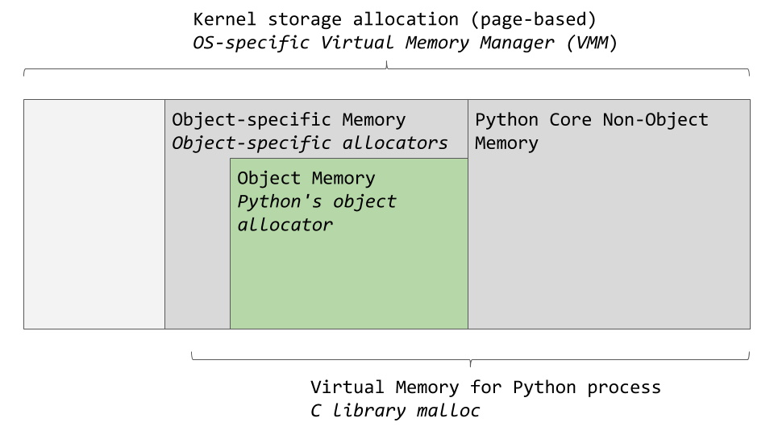
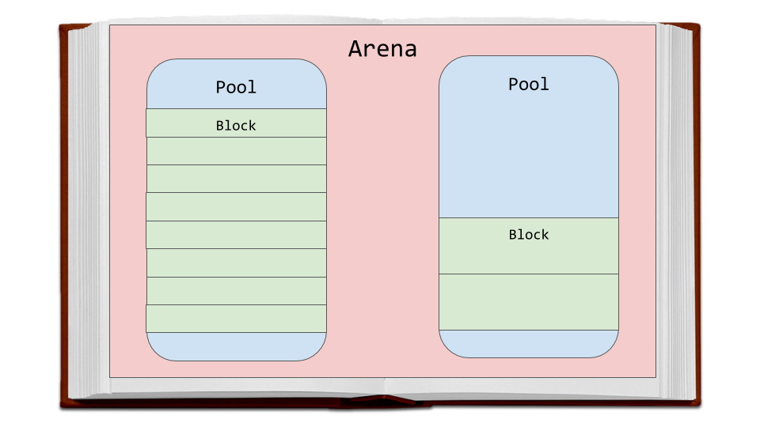
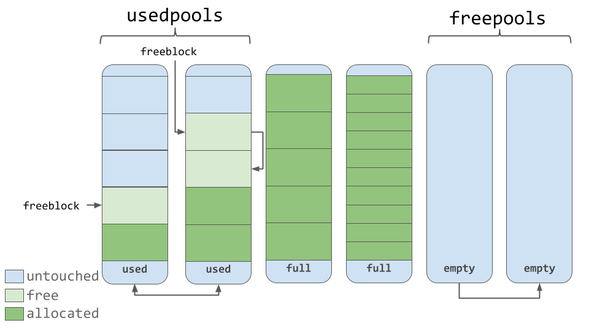
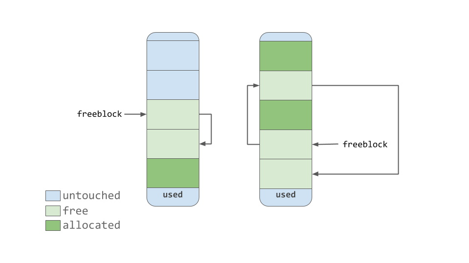
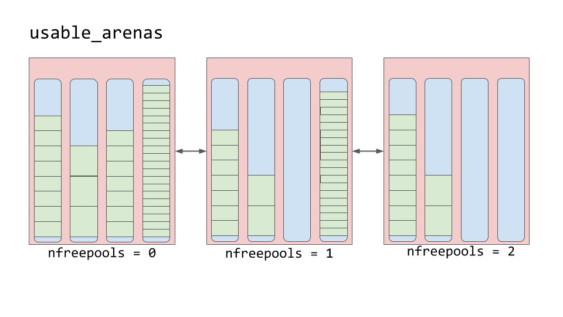

> 原文链接：https://realpython.com/python-memory-management/
>
> 发布时间：2018-11-21
>
> 作者：Alexander VanTol
>
> 译者：Roger Lee


### 目录

- 内存是一本空白的书
- 内存管理：从硬件至软件
- 默认的Python实现
- 解释器全局锁（GIL）
- 垃圾回收机制
- CPython的内存管理
  - 内存池（pools）
  - 内存块（blocks）
  - Arenas
- 总结


你是否好奇Python如何在后台处理你的数据？如何在内存中存储你的变量？它们什么时候会被删除掉吗？

在本篇文章中，我们将会深处Python内部去了解它如何进行内存管理。


**读完本篇文章后，你将：**

- 学习更多关于底层计算的内容，特别是于内存有关的。
- 理解Python是如何抽象化底层操作
- 学习更多关于Python内部内存管理机制的算法

了解Python的内部将有助于你对一些Python的行为有更好的见解。同时也希望你能够对Python有一个新的认识。在运行的背后有很多逻辑确保你的程序能够如你所期待的那样实现。


## 内存是一本空白的书

你可以想象计算机的内存就如同一本空白的书，用于写上简短的小故事，每一页纸都是空白的。之后，随着不同作者的到来，每一位作者想要一些空白的地方写上他们的故事。

由于他们不允许去修改别人的内容，所以他们必须要小心翼翼的注意他们所书写的页面。在开始写作之前，他们必须要先询问该书的管理员。然后管理员告诉他们允许书写的地方。

因为这本书已经很旧，许多书中的一些故事也不再有任何关联。当没有人阅读或者引用故事时，这些故事就会被删除，腾出空间给新的故事。

本质上，计算机的内存就像是那本空白的书。其实通常称为固定长度的连续**内存页**（memory pages），这个比喻非常切当。

书的作者更像是不同的应用或者进程，它们需要将数据存在内存里。而那个决定作者可以使用书中哪些空间的管理员，扮演着内存管理员的角色。那个把旧故事删除腾出空间给新故事的人则是一个垃圾回收员。


## 内存管理：从硬件至软件

内存管理是一个处理应用数据读写的过程。一个内存管理决定在哪里存放应用的数据。但是由于内存块是有限的，就像我们比喻的书的纸张一样，管理员需要找到可用空间并且提供给应用使用。这个将内存提供使用的过程通常被称为**内存分配**（memory allocation）。

另一方面，当数据已经不再被使用时，它就可以被删除或者被释放。但是释放到哪里去？这个“内存”又是从何而来呢？

当你运行Python程序时，在计算机的某个地方，有一个物理设备用于存储数据。然而在对象去到硬件前，Python代码需要经过许许多多的抽象层。

其中一个主要的层就是位于硬件（例如RAM或者一个硬盘驱动器）上层的操作系统，简称OS。它根据要求去执行（或者拒绝）读写内存。

在操作系统之上就是应用程序，其中一个就是默认的Python实现（被预先安装在你的操作系统或者从python.org下载安装的）。你代码的内存管理是由Python应用进行处理。Python进行内存管理的算法和结构将是本文主要关注的内容。


## 默认的Python实现

默认的Python实现是CPython，其是由C语言编写的。当我第一次听说时，我感到非常震惊，一门语言竟然使用另一门语言来写？！不过也不完全是了，但是差不多了。

在用英文编写的官方参考手册<sup>[1]</sup>中对Python语言进行了定义。然而，该参考手册并不是那么有用，因为你还是需要自己根据手册中的规则去解释Python代码。

而且你还需要在一台计算机上实际的执行已解释的代码。默认的Python实现可以满足这两个需求。它将你的Python代码转换成指令，之后就可以在一台虚拟机（ virtual machine）上面运行。

> 虚拟机和物理计算机差不多，但是它们是使用软件实现的。它们通常处理基本的指令，与汇编指令<sup>[2]</sup>相似。

Python是一门解释性编程语言。你的Python代码实际上编译成更为计算机可读的指令，称为字节码<sup>[3]</sup>（bytecode）。这些指令在你运行代码后就会被一个虚拟机解释。

你是否有曾见过一个`.pyc`文件或者`__pycache__`文件夹？这些就是被虚拟机解释过的字节码。

值得注意的是，除了CPython这个实现，还有其他不同的Python实现。IronPython<sup>[4]</sup>把代码编译成可在微软公共语言运行时（Common Language Runtime）运行。Jython<sup>[5]</sup>把代码编译成Java字节码用于在Java虚拟机运行。最后是PyPy<sup>[6]</sup>，不过它得用整整一篇文章来写，所以这里我就提及一下足以。

对于编写本篇文章的目的，我会专注于CPython作为Python默认实现时内存的管理机制。

> 免责声明：因为所有这些信息是基于现在Python的最新版本，有些东西将来可能会改变。所以要注意的是，这篇文章使用的是当前最新的Python版本  3.7<sup>[7]</sup>。

好吧，所以CPython是使用C语言编写，它解释Python字节码。但是这和内存管理有什么关系吗？其实，内存管理的算法和结构就存在于CPython的代码之中， 在C语言代码里。要理解Python的内存管理，那你就得对CPython本身有一个基本的了解。

CPython使用C语言编写，其本身原生不并支持面向对象编程。就因为这样，在CPython代码里面有非常多有趣的设计。

你可能听说过，在Python里面一切皆是对象，甚至连类型`int`和`str`也是如此。在CPython的实现层面上确实如此。有一个`struct`类型叫`PyObject`，这是在CPython中的每一个对象都使用的。

> 注意：struct 或者结构体，在C语言中是一种自定义的数据类型，可以将一些有关的不同类型变量组织起来构造成一个结构体。与面向对象编程语言相比，它就像是class里的属性，但是没有编写方法。

这个`PyObject`就像是Python里所有对象的祖师爷，进包括两样东西：

- `ob_refcnt`：引用计数
- `ob_type`：指向类型对象的指针

这个引用计数是用来帮助垃圾回收的。然后你有一个指针指向一个具体的对象类型。这个对象类型只是另一个`struct`，其描述Python的对象，例如一个`dict`或者`int`。

每个对象都有自己对象特定（object-specific）的内存分配器，它知道如何将内存分配给对象进行存储。每个对象也有一个对象特定的内存回收器来释放这些不再被使用的内存。

然而，在我们所谈论的内存分配与释放中，有一个非常重要的影响因素，那就是内存实际上是一个计算机上的共享资源，并且不好的事情可能会发生，如果两个不同的进程同一时间尝试去写入同一个相同的内存地址。


# 全局解释锁（GIL）

GIL是一个用来解决共享资源这类常见问题的方案，例如计算机的内存。当两个线程同一个时间尝试去修改一个相同的资源时，它们会互踩脚趾。最终的结果会是一片狼藉，只有一个线程得到它想要的结果。

回到用书做的比喻，假设两个作者都顽固的认为当前是到他们写的时候。不仅如此，他们两个可能还同一时间在同一本书的同一页上写。

他们都忽略了另外一方尝试去编写故事并且还在同一页纸。最后的结果是两个故事都在彼此的上面，这样就会造成整页都不可读。

对于这个问题的解决方案就是当一个线程和共享资源（书上的页纸）交互的时候，在解释器上使用一个单独全局锁。换句话说，只允许同一个时间内允许一个作者写作。

Python的GIL通过将整个解释器锁住来完成这个操作，这也就意味着不会再发生线程互踩的情况了。当CPython处理内存时，它使用GIL来保证操作的安全性。

当然，这种方式是也是有利弊的，并且对于这个GIL在Python社区里也是有非常激烈的争辩。想要更了解GIL， 我建议看一下这篇文章《什么是Python全局解释锁(GIL)》<sup>[8]</sup>。


# 垃圾回收机制

让我们再回到用书做的比喻，假设书中有些故事已经非常老了。没有读者，书中的故事也不再被引用。如果已经没有读者或者没有人引用这些故事到他们的作品里，你可以将它们删除，并将空间让给新的故事。

一个陈旧且不被再引用的故事可以比作一个在Python中引用计数为0的对象。要记住，Python中的每一个对象都有一个引用计数和指向类型对象的指针。

引用计数增加有几个不同的原因。例如，引用计数在你分配它给其它变量的时候会增加：

```python
numbers = [1, 2, 3]
# 引用计数 = 1
more_numbers = numbers
# 引用计数 = 2
```

在你将它作为参数时引用计数也会增加：

```python
total = sum(numbers)
```

最后一个例子，如果你将对象放置到一个列表里，这个引用计数也会增加：

```python
matrix = [numbers, numbers, numbers]
```

Python允许你使用`sys`模块来检查一个对象当前的引用计数。你可以使用`sys.getrefcount(numbers)`，但是你要记住，当你将对象传入`getrefcount()`时同样会引用计数加一。

在任何情况下，如果一个对象只要还被你的代码所需要，它的引用计数就会大于0。但是只要它降到0，这个对象指定的回收器将会把这个对象所使用的内存释放掉，这样其他对象就能使用。

但是“释放”内存是什么意思呢？其他对象又是如何使用它的呢？让我们直接来了解CPython的内存管理机制吧。


# CPython的内存管理机制

我们将要深入探究CPython的内存架构和算法，所以请系好安全带。

正如前面提到的，在物理硬件到CPython之间有一些抽象层。操作系统抽象化物理内存并创建一个虚拟的内存层，该内存层可以被应用（包括Python）访问。

一个操作系统特定（OS-specific）虚拟内存管理器会为Python进程分配一块内存空间。在下图里面，深灰色的块目前就是被Python进程所拥有：



Python从内存中取出一部分用于内部使用和非对象内存。其他部分则用于对象存储（你的`int`、`dict`和其他）。这描述还是有点简单了。如果你想要了解全貌，你可以看一下这个CPython源代码<sup>[9]</sup>，所有关于内存管理都在里面了。

CPython有一个对象分配器主要负责在对象内存区域分配内存空间。这个对象分配器就是大多数神奇出现的地方。当一个新的对象需要内存分配或者移除时它就会被调用。

通常，Python对象的数据添加和移除，例如`list`和`int`，每次并不会涉及太多的数据。所以分配器的设计倾向于每次处理少量的数据。它也尝试不去分配内存直到真的需要分配内存。

在源代码<sup>[10]</sup>的注释里将分配器称为“一个高速、为内存块设计的专用的内存分配器，使用在通用的内存管理器（malloc）之上”。在这个例子中，`malloc`是C语言用来进行内存分配的库功能。

现在我们将看一下CPython的内存分配的策略。首先，我们会讨论三个主要的部分，并且它们是如何联系在一起的。

Areans是最大内存块并且与内存里的页边界对齐。一个页边界操作系统使用的一个固定长度连续的内存块的边缘。Python假设系统的系统页面大小是256 kb。



在arena之内是内存池（pools），是一个虚拟的内存页（4 kb）。这些就像是我们比喻的书中的页纸。内存池被分成更小的内存块。

在内存池里的内存块拥有相同的“尺寸级”（size class）。一个尺寸级定义一个特定的块大小，给予一些所需的数据。下面这张表是直接从源代码<sup>[11</sup>的注释拿出来的：

| Request in bytes | Size of allocated block | Size class idx |
| ---------------- | ----------------------- | -------------- |
| 1-8              | 8                       | 0              |
| 9-16             | 16                      | 1              |
| 17-24            | 24                      | 2              |
| 25-32            | 32                      | 3              |
| 33-40            | 40                      | 4              |
| 41-48            | 48                      | 5              |
| 49-56            | 56                      | 6              |
| 57-64            | 64                      | 7              |
| 65-72            | 72                      | 8              |
| …                | …                       | …              |
| 497-504          | 504                     | 62             |
| 505-512          | 512                     | 63             |

例如，如果需要42个字节，数据会被放置到一个48 字节的内存块中。


### 内存池

内存池是从一个单独尺寸级的内存块组成。每个内存池维护一个双向链表连接到其他拥有相同尺寸级的内存池。通过这种方式，算法可以更简单为给定大小的内存块的寻找到可用区域。

内存池本身一定会处于其中这三种状态：`已使用（used）`、`已满（full）`或者`空闲（empty）`。一个`已使用`的内存池有可用的内存块用于存储数据。一个`已满`的内存池里的内存块都已经全部被分配且包含数据。一个`空闲`的内存池没有存储任何数据并且当需要的时候，可以分配给任何尺寸级的内存块。

一个`空闲池（freepools）`列表会就记录所有处于`空闲`状态的内存池。但是什么时候空闲池才被使用呢？

假设你的代码需要一个八字节大小的内存。如果在`已使用池（usedpools）`中没有八字节的尺寸级，一个新的`空闲池`就会被初始化用来存储八字节的内存块。这个新的内存池稍后就会被添加到`已使用池（usedpools）`列表，这样它就可以为将来的需求所使用。

还有，一个`已满池`会使用一些自己的内存块，因为这些内存块已不再被使用。然后这个内存池会根据其尺寸级会被重新添加到`已使用池（usedpools）`列表中。

你现在可以看到内存池是如何根据这个算法在这些状态间自由的移动（甚至内存尺寸级）。


### 内存块



从上面的图表可以看到，内存池包含一个指针指向它们的“空闲”内存块。这个的工作方式有写细微的差别。根据源码的注释中指出：这个分配器 “努力不去触碰所有层级（arena、内存池、内存块）的任何一块内存直到需要真的被需要”。

这就是说，一个内存池有处于三种状态的内存块。这些状态被定义如下：

- 未被接触（untouched）:一些尚未被分配的内存
- 空闲：一些已经被分配的内存，但是之后被CPython释放并且不再包含相关数据
- 已分配：已经被分配的内存，并且包含相关的数据

一个`空闲内存块（freeblock）`指针指向一个空闲内存块的单链表。换句话说，就是一个用于存储数据的可用区列表。如果需要更多的可用区，分配器会将一些`未被接触`的内存块放到内存池中。

因为内存管理器释放了内存块，这些被释放的内存块被添加到`空闲内存块`列表的前面。实际的列表可能不是连续的内存块，像那第一个图表。它可能看起来像以下图表：



### Arenas

Arenas包括内存池。这些内存池会有已使用、已满和空闲这些状态。Arenas自己本身并没有像内存池那样的明显状态。

Arenas却是分类成一个双链表叫做`usable_arenas`。这个列表根据空闲池的数据进行排序。拥有的内存池越少，Arena就越靠近列表的前面。



这也就意味着那些含有数据最多的Arena就会被先选择用来存储数据。但是为什么不是反过来呢？为什么不把数据放到可用空间更多的Arena呢？

这给我们引出了真正的内存释放的理念。你注意到我已经多次提到了“释放”这个词。原因是当一个内存块被释放的时候，这个内存实际上并不会被释放回到操作系统，Python进程保持其分配并且用于之后到来的新数据。真正的释放内存会将内存返回给操作系统使用。

Arenas是唯一可以被真正释放的东西，显然这些近乎空闲的arenas应该允许成为空闲。这样做的话，那些内存块才能够被真正的释放，以减少你Python程序的整体内存占用（memory footprint）。


# 总结

内存管理是一个与计算机工作的重要部分。不管好坏，Python几乎在后台处理了所有这些东西。

通过阅读本文，你将学到：

- 内存管理是什么，为何其如此重要
- Python的默认实现 - CPython（使用C语言编写）
- 在CPython里的数据结构和算法是如何共同工作来帮助内存管理处理你的数据的

Python抽象化了一些与计算机工作的繁琐细节。这给予你可以从高级层面去编写代码的力量，不用去担心那些令人头疼的问题，例如如何或者哪里去存储那些以保存的数据。


# 文中引用链接

[1] https://docs.python.org/3/reference/index.html

[2] https://en.wikipedia.org/wiki/Assembly_language

[3] https://docs.python.org/3/glossary.html#term-bytecode

[4] http://ironpython.net/

[5] http://www.jython.org/

[6] https://pypy.org/

[7] https://realpython.com/python37-new-features/

[8] https://realpython.com/python-gil/

[9] https://github.com/python/cpython/blob/7d6ddb96b34b94c1cbdf95baa94492c48426404e/Objects/obmalloc.c

[10] https://github.com/python/cpython/blob/7d6ddb96b34b94c1cbdf95baa94492c48426404e/Objects/obmalloc.c

[11] https://github.com/python/cpython/blob/7d6ddb96b34b94c1cbdf95baa94492c48426404e/Objects/obmalloc.c